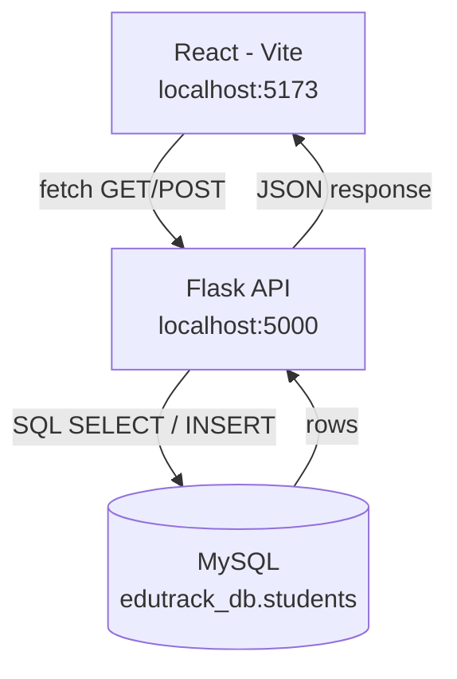

# EduTrack — Student Management (React + Flask + MySQL)

## Project Overview

A student management application built incrementally across Days 41-44 of
the Innolift Ventures internship. React (Vite) is the frontend, Flask is
the backend API, and MySQL is the persistent data store — the full
three-layer flow: **React → Flask → MySQL**.

The public-facing student directory lets anyone view the current student
list and add a new student through a form; data written through the form
is saved to MySQL and survives a page refresh or server restart.

## Technology Stack

| Layer | Technology |
|---|---|
| Frontend | React (Vite) |
| Backend | Flask, Flask-CORS |
| Database | MySQL (`mysql-connector-python`) |
| Config | `python-dotenv` (environment variables) |

## MySQL Database Setup

Database: `edutrack_db`

1. Run `schema.sql` / `full_setup.sql` to create the base tables.
2. Run `migration_day42_add_email.sql` — adds the `email` column to
   `students` (not part of the original schema).
3. Run `migration_day44_unique_email.sql` — adds a `UNIQUE` constraint on
   `email`, which the duplicate-email error handling below relies on.
   Read the comment at the top of that file first — it includes a query
   to check for pre-existing duplicate emails before applying it.

## Database Structure

Relevant columns on `students` (full table also holds academic/risk data
used elsewhere in the app — admission grade, GPA, attendance, dropout
risk, etc.):

| Column | Type | Notes |
|---|---|---|
| `id` | INT, PK, auto-increment | |
| `name` | VARCHAR(100), NOT NULL | |
| `roll_no` | VARCHAR(20), UNIQUE, NOT NULL | auto-generated for students created via the public form |
| `course` | VARCHAR(100) | |
| `email` | VARCHAR(150), UNIQUE | added Day 42, made UNIQUE Day 44 |

## API Endpoints

### `GET /api/students`

Public, unauthenticated. Returns all students from MySQL as JSON.

```json
[
  { "id": 1, "name": "Kavya Rao", "email": "stu-20261001@crescent.edu", "course": "Management (evening)" }
]
```

Error responses:
```json
{ "success": false, "error": "Unable to reach the database. Please try again shortly." }
{ "success": false, "error": "Unable to load students right now." }
```

### `POST /api/students`

Public, unauthenticated. Creates a student.

Request body:
```json
{ "name": "Vijay S", "email": "vijay@crescent.edu", "course": "CS & BS" }
```

Success response (`201`):
```json
{ "success": true, "student": { "id": 16, "name": "Vijay S", "email": "vijay@crescent.edu", "course": "CS & BS" } }
```

Error responses:
```json
{ "success": false, "error": "name, email, and course are all required" }
{ "success": false, "error": "A student with that email already exists." }
{ "success": false, "error": "Unable to save student." }
{ "success": false, "error": "Unable to reach the database. Please try again shortly." }
```

> Note: `roll_no` isn't collected from the form — it's a system detail,
> not something a public sign-up form should ask for — so it's generated
> server-side (`NEW-<timestamp>`) to satisfy the column's `UNIQUE NOT NULL`
> constraint.

## Frontend → Backend → MySQL Architecture



**GET flow:** MySQL → Flask (`SELECT`) → JSON response → React `fetch()` →
`useState()` → student list rendered.

**POST flow:** React form (`useState` per field) → `fetch()` POST → Flask
validates → MySQL `INSERT` → JSON response → success message → student
list updates in place, no page refresh.

## How to Run the Project

1. **Backend**
   ```
   cd Backend
   pip install -r requirements.txt
   python app.py
   ```
   Runs on `http://localhost:5000`.

2. **Frontend** (separate terminal)
   ```
   cd Frontend/innolift
   npm install
   npm run dev
   ```
   Runs on `http://localhost:5173`.

3. Open `http://localhost:5173`.

## Environment Configuration

Database credentials are never hardcoded — `db.py` reads them from a local
`.env` file via `python-dotenv`:

```
DB_HOST=localhost
DB_USER=root
DB_PASSWORD=your_mysql_password
DB_NAME=edutrack_db
```

`.env` is listed in `.gitignore` and is never committed. `.env.example`
(committed) documents the required variable names without real values.

## Error Handling

| Failure | Handling |
|---|---|
| Database unreachable | `get_connection()` returns `None`; route responds with a clear JSON error before touching a cursor |
| Invalid/failed query | Wrapped in `try/except Error`; returns a generic JSON error instead of a raw traceback |
| Missing required fields | Validated before any DB call; `400` with a specific message |
| Duplicate email | Caught via MySQL error code `1062` (relies on the `UNIQUE` constraint from `migration_day44_unique_email.sql`); returns a specific "already exists" message |
| Frontend | All `fetch()` calls use `try/catch` + `response.ok` checks; the response body is parsed defensively so a broken/non-JSON response never surfaces a raw parsing error to the user; `loading` state always resolves via `finally` |
